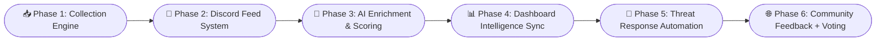

<!-- 🔰 Hero Typing Banner -->
<div align="center">
  
</div>

<!-- 🧠 Logo & Focus Area -->
<div align="center">
  
  <h3>
    🛡️ <strong>Cybersecurity</strong> &nbsp;&nbsp;|&nbsp;&nbsp;
    💰 <strong>Finance</strong> &nbsp;&nbsp;|&nbsp;&nbsp;
    💼 <strong>Business Development</strong>
  </h3>

</div>

---

<div align="center">

## 🧠 About Me
</div>

🛠️ **Toolsmith for Cybersecurity Simulation & Defense**  
🔍 *Expertise:* Red Team Operations · Memory Forensics · Detection Engineering · CTI Pipelines  
📊 *Approach:* Offensive R&D meets Threat Simulation and Detection Strategy  
🚀 *Projects:* `KeysGuard`, `CyberNetics`, `AIShadow`, and more  
⚙️ *Philosophy:* Always learning, always building — across code, systems, and adversary logic  

> 🛰️ *“Assume breach. Simulate smarter.”*

---

<div align="center">

[](https://github.com/vVv-Keys)
[](https://github.com/vVv-Keys)
[](https://discord.gg/zxAkGet7Qs)
[](https://about-keys.vercel.app/)

</div>

---

<div align="center">
  


## 🎯 Currently Building
</div>
<table>
  <tr>
    <td valign="top" width="50%">
      
### 🛰️ GhostSec Intelligence Dashboard
- MITRE-mapped alerts  
- TTP tagging engine  
- Live threat heatmaps  

**_Purpose:_** Tactical SOC dashboard for red/purple ops.  

<details><summary><b>📦 Status</b></summary>

- [x] TTP Mapping Engine  
- [x] MITRE Layer Integration  
- [ ] Live Threat Heatmap Panel  
- [ ] AI Recommendation Module  

</details>

</td>
    <td valign="top" width="50%">
      
### 🧠 Quantum Threat Fusion Engine
- AI threat scoring  
- TTP → Actor chaining  
- CTI graph modeling  

**_Purpose:_** Contextual threat actor analysis via enrichment pipelines.  

<details><summary><b>📦 Status</b></summary>

- [x] IOC Normalizer  
- [x] NLP Entity Extractor  
- [ ] Graph Relationship Mapper  
- [ ] Analyst Dashboard  

</details>

</td>
  </tr>
  <tr>
    <td valign="top" width="50%">

### 🔁 Discord ↔ Webhook ↔ DB System
- Real-time IOC enrichment  
- Modular routing engine  
- API/Webhook ↔ DB sync  

**_Purpose:_** Cross-platform comms layer for CTI and detection systems.  

<details><summary><b>📦 Status</b></summary>

- [x] Discord Bot Engine  
- [x] Webhook ↔ Router Logic  
- [ ] DB Event Sync Layer  
- [ ] Audit Logging Panel  

</details>

</td>
    <td valign="top" width="50%">

### 🧩 Modular Deception Framework
- GhostFrames + Honeytokens  
- Campaign visualizer tooling  
- Sensor-based telemetry  

**_Purpose:_** Deception ops infrastructure for adversary misdirection.  

<details><summary><b>📦 Status</b></summary>

- [x] GhostFrame Dropper  
- [x] Honeytoken Generator  
- [ ] Campaign Visualizer  
- [ ] Alerting Correlation Layer  

</details>

</td>
  </tr>
</table>

<div align="center">

### 📚 KeysGuard Academy  
Red/Purple team curriculum • Field-grade cyber ops modules  
<sub><i>Purpose: Open-access tactical training under 404Labs.</i></sub>

</div>

---
<div align="center">

## 🛰️ MITRE ATT&CK visualizer, terminal CLI, and threat feed panel built using HTML/CSS/JS.

<table align="center">
  <tr>
    <!-- Top‐row: two side-by-side images -->
    <td align="center">
      <a href="https://vvv-keys.github.io/vVv-Keys/" target="_blank">
        
      </a>
    </td>
    <td align="center">
      
    </td>
  </tr>
  <tr>
    <!-- Bottom‐row: one image spanning both columns -->
    <td colspan="2" align="center">
      
    </td>
  </tr>
</table>
</div>


## 📆 Roadmap Preview


```markdown
### 🗂 Phase Breakdown 🔍

- **📥:** Ingest data from honeypots, CTI APIs, Discord feeds, etc. Normalize into structured IOCs/events.
- **🔁:** Route threat data via modular Discord bot ↔ webhook ↔ DB sync engine.
- **🧠:** Enrich and score threats using LLMs, NLP, and signature systems.
- **📊:** Visualize intelligence via dashboards, MITRE overlays, and terminal interfaces.
- **🤖:** Trigger responses with SIGMA rules, heuristics, or chained TTPs.
- **🌐:** Let the community vote, validate, and contribute scoring intelligence.
```

<div align="center">

| Tools | Gists | Micro-Labs |
|--------|-----------|--------|
| 🧪 [`Sigma + YARA Labs`](https://gist.github.com/vVv-Keys) | *(Public-ready hunting templates)* | X |
| 🐍 [`Python CTI Enrichers`](https://github.com/vVv-Keys/KeysTools) | *(Live enrichment plugins)* | X |
| 📎 [`One-file PoCs`](https://github.com/vVv-Keys/aishadow-malware-labs/tree/main/standalone-pocs) | *(Custom + Enhanced)* | X | 
| 📡 [`IOC Validators`](https://github.com/vVv-Keys/404-CTI) | *(Modular + webhook driven)* | X | 

</div>

<div align="center">

<br>

---
## 🧠 Technical Arsenal

💡 <i>Available in GhostSec Dashboard with MITRE Tagging + AI Commentary</i>

<!-- Threat Feed Badges -->
<a href="https://www.virustotal.com/" target="_blank">
  
</a>

<a href="https://abuseipdb.com/" target="_blank">
  
</a>

<a href="https://threatfox.abuse.ch/" target="_blank">
  
</a>

<a href="https://otx.alienvault.com/" target="_blank">
  
</a>

</div>

<div align="center">

--- 

<details open>
<summary><strong>🧾 Languages & Scripting</strong></summary>

<p align="center">


</p>
</details>

<details open>
<summary><strong>🖥️ Platforms & Infrastructure</strong></summary>

<p align="center">


</p>
</details>

<details open>
<summary><strong>🔐 Security Disciplines</strong></summary>

<p align="center">


</p>
</details>

<details open>
<summary><strong>⚙️ Tools & Frameworks</strong></summary>

<p align="center">


</p>
</details>


</div>


## 🚀 Featured Projects

<div align="center">
<a href="https://github.com/vVv-Keys/KeysGuard">
  
</a>
<a href="https://github.com/vVv-Keys/404-CTI">
  
</a>
<a href="https://github.com/vVv-Keys/404-DiscoBOT">
  
</a>
<a href="https://github.com/vVv-Keys/KeysTools">
  
</a>
<a href="https://github.com/vVv-Keys/aishadow-malware-labs">
  
</a>
<a href="https://github.com/vVv-Keys/purple-threat-sim-campaign-001">
  
</a>
<a href="https://github.com/vVv-Keys/cyber-loveable-project">
  
</a>
<a href="https://github.com/vVv-Keys/AI-ML-Learning-Resource-Hub">
  
</a>
<a href="https://github.com/vVv-Keys/NTFS-Security-Descriptor-Analyzer">
  
</a>
<a href="https://github.com/vVv-Keys/atomic-red-team">
  
</a>
</div>

## 🔐 Private Projects (Overview)

> **Note**: Below are high-level overviews of private projects maintained internally under **404Labs** / **KeysGuard Division**. Access by request or through collaboration.

| Project Name | Description |
|--------------|-------------|
| `KeysGuard-CyberAcademy` | Internal training academy platform offering red/blue/purple team simulations and cybersecurity cert labs. |
| `AI Architect Diagram` | Visual automation diagrams for complex AI threat detection and response systems. |
| `404-INTELNET` | Distributed Threat Intel harvesting & enrichment system. |
| `KeysGuard ThreatNet` | Federated cyber sensor network for real-time threat aggregation. |
| `CyberNETICS-CTI` | Machine intelligence-driven CTI fusion engine. |
| `ThreatScape-CTI` | Threat actor profiling, campaign analysis & CTI reporting automation. |
| `404-GhostFrame` | Deception framework for adversary misdirection and honeynet management. |
| `404-Dashboard` | Unified visualization dashboard across red/purple/CTI environments. |
| `404-Cache` | Fast, ephemeral memory store for offensive engagements and TTPs. |
| `404-Auth` | Internal authentication suite with multi-domain and federated ID support. |

</div>

---

## 📬 Want to Collaborate?

If you’re in the space of cybersecurity, AI fusion, red/purple team operations, or CTI platforms — I’m open to partnerships, collabs, or secure repo access upon serious inquiry.

Reach out via GitHub or drop me a secure message.

---

## 🏆 GitHub Trophies

<div align="center">

[](https://github.com/vVv-Keys)

</div>

<div align="center">

⚡ *Pushing boundaries, one line of code at a time.*

---

