---
<!-- 🌐 PAGE OUTLINE NAVIGATION -->
<div align="center">
  <a href="#🧠-about-me">🧠 About</a> •
  <a href="#🎯-currently-building">🛠️ Projects</a> •
  <a href="#🛰️-mitre-att\&ck-visualizer">📡 Dashboard</a> •
  <a href="#📆-roadmap-preview">📆 Roadmap</a> •
  <a href="#🚀-featured-projects">🚀 Projects</a> •
  <a href="#🔐-private-projects-overview">🔐 Private</a> •
  <a href="#📬-want-to-collaborate">🤝 Contact</a>

---
<div align="center">
  
</div>

<div align="center">
  
</div>

---
# 🧠 ABOUT ME:
<!-- 🎛️ Animated Stack Ribbon (STATIC FAKE TICKER) -->
<div align="center">
  
  <h3>
    🛡️ <strong>Cybersecurity</strong> &nbsp;&nbsp;|&nbsp;&nbsp;
    💰 <strong>Finance</strong> &nbsp;&nbsp;|&nbsp;&nbsp;
    💼 <strong>Business Development</strong>
  </h3>

</div>

🔬 Originator of Quantum Threat Intelligence™ (QTI)©
📜 Published 2025 via GitHub, NSA SOS, and KeysGuard IP archive

---

🛠️ **Toolsmith for Cybersecurity Simulation & Defense**  
🔍 *Expertise:* Red Team Operations · Memory Forensics · Detection Engineering · CTI Pipelines  
📊 *Approach:* Offensive R&D meets Threat Simulation and Detection Strategy  
🚀 *Projects:* `KeysGuard`, `CyberNetics`, `AIShadow`, and more  
⚙️ *Philosophy:* Always learning, always building — across code, systems, and adversary logic  

> 🛰️ *“Assume breach. Simulate smarter.”*

<div align="center">

[](https://github.com/vVv-Keys)
[](https://github.com/vVv-Keys)
[](https://discord.gg/zxAkGet7Qs)
[](https://about-keys.vercel.app/)

</div>

# 🎯 Currently Building:
<table>
  <tr>
    <td valign="top" width="50%">
      
### 🛰️ GhostSec Intelligence Dashboard
- MITRE-mapped alerts  
- TTP tagging engine  
- Live threat heatmaps  

**_Purpose:_** Tactical SOC dashboard for red/purple ops.  

<details><summary><b>📦 Status</b></summary>

- [x] TTP Mapping Engine  
- [x] MITRE Layer Integration  
- [x] Live Threat Heatmap Panel  
- [x] AI Recommendation Module  

</details>

</td>
    <td valign="top" width="50%">
      
### 🧠 Quantum Threat Fusion Engine
- AI threat scoring  
- TTP → Actor chaining  
- CTI graph modeling  

**_Purpose:_** Contextual threat actor analysis via enrichment pipelines.  

<details><summary><b>📦 Status</b></summary>

- [x] IOC Normalizer  
- [x] NLP Entity Extractor  
- [ ] Graph Relationship Mapper  
- [ ] Analyst Dashboard  

</details>

</td>
  </tr>
  <tr>
    <td valign="top" width="50%">

### 🔁 Discord ↔ Webhook ↔ DB System
- Real-time IOC enrichment  
- Modular routing engine  
- API/Webhook ↔ DB sync  

**_Purpose:_** Cross-platform comms layer for CTI and detection systems.  

<details><summary><b>📦 Status</b></summary>

- [x] Discord Bot Engine  
- [x] Webhook ↔ Router Logic  
- [x] DB Event Sync Layer  
- [x] Audit Logging Panel  

</details>

</td>
    <td valign="top" width="50%">

### 🧩 Modular Deception Framework
- GhostFrames + Honeytokens  
- Campaign visualizer tooling  
- Sensor-based telemetry  

**_Purpose:_** Deception ops infrastructure for adversary misdirection.  

<details><summary><b>📦 Status</b></summary>

- [x] GhostFrame Dropper  
- [x] Honeytoken Generator  
- [ ] Campaign Visualizer  
- [ ] Alerting Correlation Layer  

</details>

</td>
  </tr>
</table>

<div align="center">

### 📚 KeysGuard Academy  
Red/Purple team curriculum • Field-grade cyber ops modules  
<sub><i>Purpose: Open-access tactical training under 404Labs.</i></sub>

</div>

<!-- 🔥 NEON SEPARATOR -->
<div align="center">
  
</div>

<!-- 📆 ROADMAP PREVIEW -->
<div align="center">
  <table>
    <tr>
      <td></td>
      <td></td>
      <td></td>
    </tr>
  </table>
</div>

<!-- 🔍 MITRE ATT&CK Technique Highlights -->
<div align="center">
  <h4>🕹️ MITRE ATT&CK TTP Highlights</h4>
  <details>
    <summary><strong>🔍 Expand MITRE TTP Highlights</strong></summary>
    <br>
    <table>
      <tr>
        <td></td>
        <td></td>
        <td></td>
      </tr>
      <tr>
        <td></td>
        <td></td>
        <td></td>
      </tr>
    </table>
  </details>
</div>

---

<!-- 💡 TOOLS AND MICROLABS -->
<div align="center">
  <table width="100%">
    <thead>
      <tr>
        <th>🔧 Tools</th>
        <th>🧠 Gists</th>
        <th>🧪 Micro-Labs</th>
      </tr>
    </thead>
    <tbody>
      <tr>
        <td>🧪 <a href="https://gist.github.com/vVv-Keys">Sigma + YARA Labs</a></td>
        <td><em>Public-ready hunting templates</em></td>
        <td align="center">✔️</td>
      </tr>
      <tr>
        <td>🐍 <a href="https://github.com/vVv-Keys/KeysTools">Python CTI Enrichers</a></td>
        <td><em>Live enrichment plugins</em></td>
        <td align="center">✔️</td>
      </tr>
      <tr>
        <td>📌 <a href="https://github.com/vVv-Keys/aishadow-malware-labs/tree/main/standalone-pocs">One-file PoCs</a></td>
        <td><em>Custom + Enhanced</em></td>
        <td align="center">✔️</td>
      </tr>
      <tr>
        <td>🛁 <a href="https://github.com/vVv-Keys/404-CTI">IOC Validators</a></td>
        <td><em>Modular + webhook driven</em></td>
        <td align="center">✔️</td>
      </tr>
    </tbody>
  </table>
</div>

---

<!-- 🧩 PROJECT CARD SHOWCASE -->
<div align="center">
  <table>
    <tr>
      <td>
        <a href="https://github.com/vVv-Keys/KeysGuard">
          
        </a>
      </td>
      <td>
        <a href="https://github.com/vVv-Keys/404-CTI">
          
        </a>
      </td>
    </tr>
    <tr>
      <td>
        <a href="https://github.com/vVv-Keys/AI-ML-Learning-Resource-Hub">
          
        </a>
      </td>
      <td>
        <a href="https://github.com/vVv-Keys/404-DiscoBOT">
          
        </a>
      </td>
    </tr>
  </table>
</div>

<!-- 🔥 NEON SEPARATOR -->
<div align="center">
  
</div>

<!-- 📆 ROADMAP PREVIEW -->

## 📆 Roadmap Preview

```mermaid
flowchart LR
  A1([📥 Phase 1: Collection Engine])
  A2([🔁 Phase 2: Discord Feed System])
  A3([🧠 Phase 3: AI Enrichment & Scoring])
  A4([📊 Phase 4: Dashboard Intelligence Sync])
  A5([🤖 Phase 5: Threat Response Automation])
  A6([🌐 Phase 6: Community Feedback + Voting])

  A1 --> A2 --> A3 --> A4 --> A5 --> A6
```


```
- 📥:Ingest data from honeypots, CTI APIs, Discord feeds, etc. Normalize into structured IOCs/events.
- 🔁:Route threat data via modular Discord bot ↔ webhook ↔ DB sync engine.
- 🧠:Enrich and score threats using LLMs, NLP, and signature systems.
- 📊:*Visualize intelligence via dashboards, MITRE overlays, and terminal interfaces.
- 🤖: Trigger responses with SIGMA rules, heuristics, or chained TTPs.
- 🌐: Let the community vote, validate, and contribute scoring intelligence.
```

<div align="center">

<br>

---
## 🧠 Technical Arsenal

💡 <i>Available in GhostSec Dashboard with MITRE Tagging + AI Commentary</i>

<!-- Threat Feed Badges -->
<a href="https://www.virustotal.com/" target="_blank">
  
</a>

<a href="https://abuseipdb.com/" target="_blank">
  
</a>

<a href="https://threatfox.abuse.ch/" target="_blank">
  
</a>

<a href="https://otx.alienvault.com/" target="_blank">
  
</a>

</div>

<div align="center">

--- 

<details open>
<summary><strong>🧾 Languages & Scripting</strong></summary>

<p align="center">


</p>
</details>

<details open>
<summary><strong>🖥️ Platforms & Infrastructure</strong></summary>

<p align="center">


</p>
</details>

<details open>
<summary><strong>🔐 Security Disciplines</strong></summary>

<p align="center">


</p>
</details>

<details open>
<summary><strong>⚙️ Tools & Frameworks</strong></summary>

<p align="center">


</p>
</details>


</div>

<!-- 🧩 PROJECT CARD SHOWCASE -->
<div align="center">
  <table>
    <tr>
      <td>
        <a href="https://github.com/vVv-Keys/KeysGuard">
          
        </a>
      </td>
      <td>
        <a href="https://github.com/vVv-Keys/404-CTI">
          
        </a>
      </td>
    </tr>
    <tr>
      <td>
        <a href="https://github.com/vVv-Keys/AI-ML-Learning-Resource-Hub">
          
        </a>
      </td>
      <td>
        <a href="https://github.com/vVv-Keys/404-DiscoBOT">
          
        </a>
      </td>
    </tr>
  </table>
</div>
</div>

<div align="center">

<!-- 🔐 PRIVATE PROJECT OVERVIEW -->
<div align="center">

<h3>🔐 Internal Projects: 404Labs & KeysGuard Division</h3>
<sub><i>Access by request • Internal only • Strategic collaboration required</i></sub>
<br><br>

<table>
  <thead>
    <tr>
      <th>🧠 Project</th>
      <th>📋 Description</th>
    </tr>
  </thead>
  <tbody>
    <tr><td><code>KeysGuard-CyberAcademy</code></td><td>Red/Blue/Purple lab platform for elite simulation tracks.</td></tr>
    <tr><td><code>AI Architect Diagram</code></td><td>Automation blueprints for real-time AI-assisted CTI ops.</td></tr>
    <tr><td><code>404-INTELNET</code></td><td>Threat intel harvester + IOC enricher grid.</td></tr>
    <tr><td><code>KeysGuard ThreatNet</code></td><td>Federated sensors with live threat telemetry ingest.</td></tr>
    <tr><td><code>CyberNETICS-CTI</code></td><td>Machine-driven attacker chaining & fusion scoring.</td></tr>
    <tr><td><code>ThreatScape-CTI</code></td><td>Adversary behavior graphing, campaign lineage, automation.</td></tr>
    <tr><td><code>404-GhostFrame</code></td><td>Decoy injection + honeynet redirection system.</td></tr>
    <tr><td><code>404-Dashboard</code></td><td>Unified intel + red team dashboard visualizer.</td></tr>
    <tr><td><code>404-Cache</code></td><td>Ephemeral operator memory store for live TTP chaining.</td></tr>
    <tr><td><code>404-Auth</code></td><td>Federated ID broker with ACL and multitenant trust.</td></tr>
  </tbody>
</table>

</div>

---
<div align="center">

## 🛰️ MITRE ATT&CK visualizer, terminal CLI, and threat feed panel built using HTML/CSS/JS.

<table align="center">
  <tr>
    <!-- Top‐row: two side-by-side images -->
    <td align="center">
      <a href="https://vvv-keys.github.io/vVv-Keys/" target="_blank">
        
      </a>
    </td>
    <td align="center">
      
    </td>
  </tr>
  <tr>
    <!-- Bottom‐row: one image spanning both columns -->
    <td colspan="2" align="center">
      
    </td>
  </tr>
</table>

---

</div>

<div align="center">

## 📬 Want to Collaborate?

💬 If you're working in **Cybersecurity**, **AI Fusion**, **Red/Purple Team Ops**, or **CTI Engineering** — 
I'm open to **partnerships**, **collabs**, or secure repo access for aligned missions.

</div>

---

<div align="center">
<a href="https://discord.gg/zxAkGet7Qs">
  
</a>

<a href="https://github.com/vVv-Keys">
  
</a>

<a href="mailto:keys@protonmail.com">
  
</a>

<a href="https://about-keys.vercel.app/contact" target="_blank">
  
</a>

</div>

---

[](https://github.com/vVv-Keys)

</div>

---

<div align="center">

⚡ *Pushing boundaries, one line of code at a time.*

---

